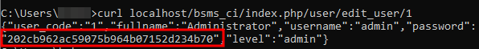

# Unauthenticated Password Hash Disclosure vulnerability

Description: Vulnerability was found in SourceCodester Book Store Management System 1.0. An Unauthenticated Password Hash Disclosure vulnerability has been identified, which can be exploited to retrieve the password hashes of all existing user accounts.

The product(s): https://www.sourcecodester.com/php/15748/book-store-management-system-project-using-php-codeigniter-3-free-source-code.html

Affected product(s)/code base: https://www.sourcecodester.com/sites/default/files/download/oretnom23/bsms_ci.zip

Affected component(s): /bsms_ci/index.php/user/edit_user/{id}

Proof of Concept: Make a non-authenticated request to retrieve the admin user password hash.

[+] Payload: `curl localhost/bsms_ci/index.php/user/edit_user/1`

Discoverer(s)/Credits: CMCSOC Redteam (@lithonn)

- Ngo Van Tu (@leecybersec)
- Tran Thi Nho (@nhott)
- Huynh Nhat Hao (@h40huynh)
- Le Thi Huyen My (@Huy3nMy)